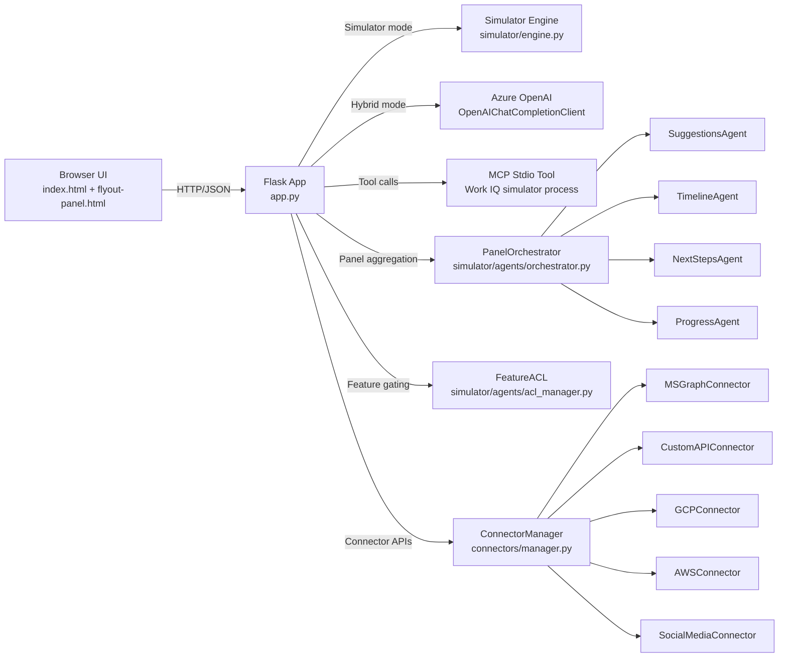
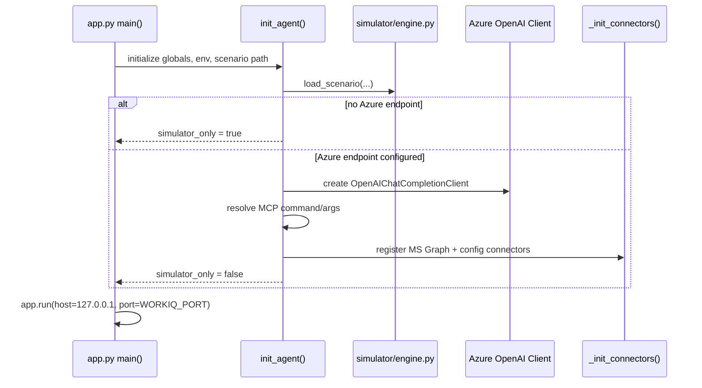
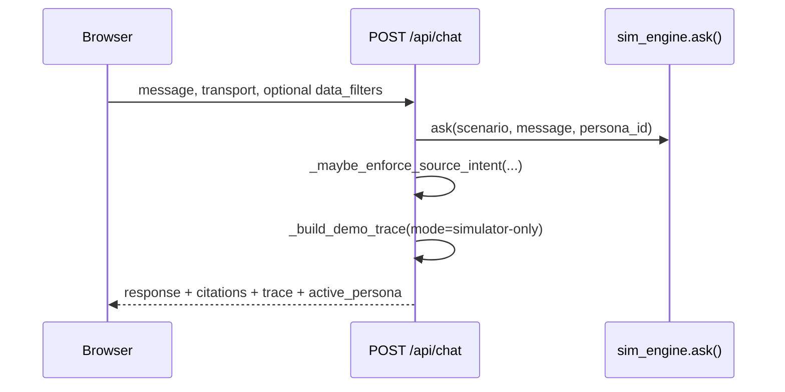
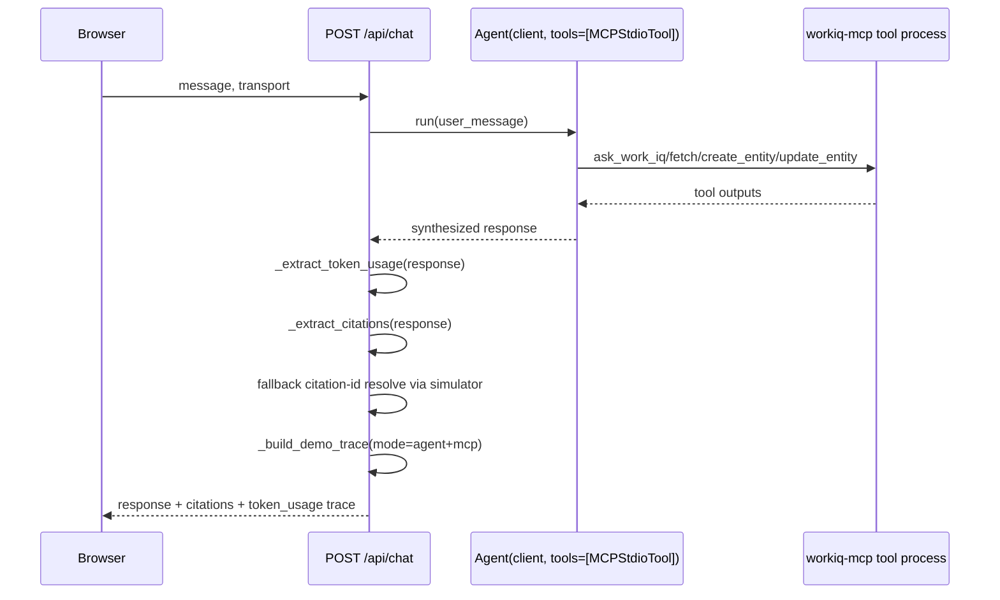
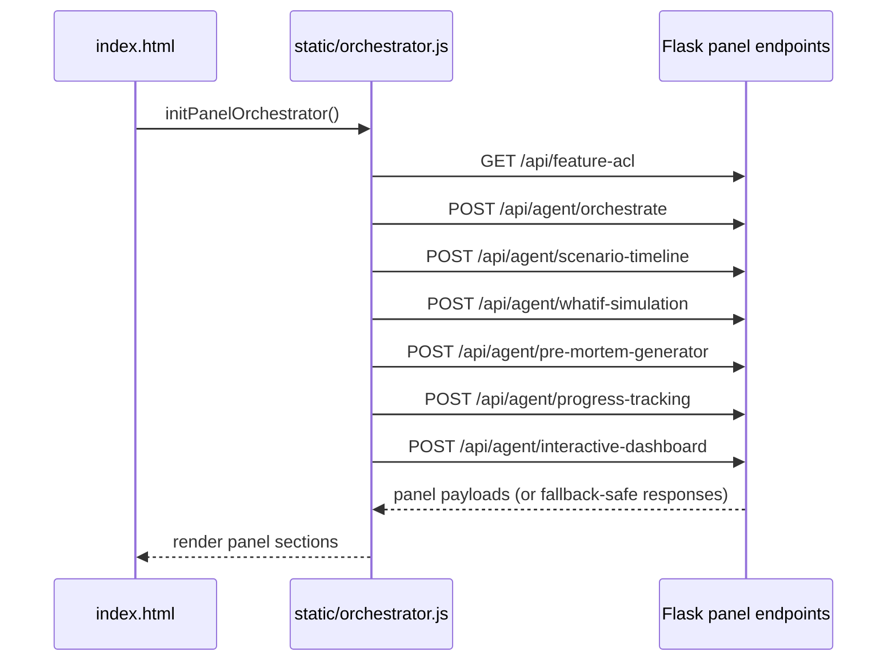
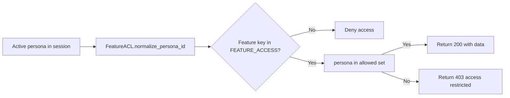
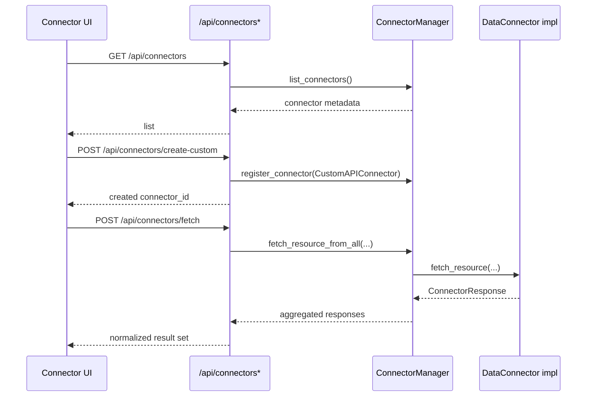

# Work IQ Architecture and Flow (Code-Derived)

This document describes the architecture and runtime flows based on the current implementation.

## 1) System Architecture



## 2) Core Backend Building Blocks

- Flask web/API layer
  - Route entry points are implemented in app.py.
  - Serves UI files directly using send_file for index and flyout panel.

- Runtime modes
  - Simulator-only mode when Azure endpoint is absent.
  - Hybrid mode when Azure endpoint is configured, with MCP tool integration.

- Scenario and persona state
  - Scenario loaded from simulator/scenarios/*.
  - Persona loaded from scenario personas.json and persisted in Flask session.

- Connector framework
  - ConnectorType and DataConnector abstractions in connectors/base.py.
  - ConnectorManager registry + orchestration in connectors/manager.py.
  - Connectors initialized at startup and exposed via connector endpoints.

- Panel agent framework
  - Parallel panel orchestration in simulator/agents/orchestrator.py.
  - Feature ACL checks in simulator/agents/acl_manager.py.

## 3) Startup Flow



## 4) Chat Request Flow

### 4.1 Simulator-Only Path



### 4.2 Hybrid (Agent + MCP) Path



## 5) Panel Load and Update Flow

### 5.1 Initial Page Load



### 5.2 Post-Message Updates

```mermaid
flowchart TD
    A[Chat response received in index.html] --> B[updateAllPanelsAfterMessage(response)]
    B --> C[POST /api/agent/timeline]
    B --> D[POST /api/agent/nextsteps]
    C --> E[UI timeline refreshed]
    D --> F[UI next steps refreshed]
```

## 6) Feature ACL Flow



## 7) Connector Flow



## 8) API Surface (Grouped)

- UI and session
  - GET /
  - GET /flyout-panel
  - GET /api/status
  - GET /api/personas
  - POST /api/persona
  - POST /api/clear

- Chat and trace
  - POST /api/chat

- Connectors
  - GET /api/connectors
  - GET /api/connectors/<connector_id>/status
  - POST /api/connectors/<connector_id>/authenticate
  - GET /api/connectors/<connector_id>/resources
  - POST /api/connectors/fetch
  - POST /api/connectors/search
  - POST /api/connectors/create-custom

- Agent and panel endpoints
  - POST /api/agent/orchestrate
  - POST /api/agent/timeline
  - POST /api/agent/nextsteps
  - POST /api/agent/progress-trend
  - GET /api/feature-acl
  - POST /api/agent/executive-brief
  - POST /api/agent/action-recommendations
  - POST /api/agent/scenario-timeline
  - POST /api/agent/whatif-simulation
  - POST /api/agent/pre-mortem-generator
  - POST /api/agent/progress-tracking
  - POST /api/agent/interactive-dashboard

## 9) Key Code Anchors Used

- app.py
  - Initialization, chat, connectors, orchestrator and panel routes.

- templates/index.html
  - UI bootstrap, chat request calls, panel initialization trigger.

- static/orchestrator.js
  - Panel orchestration, ACL load, panel-specific loaders and update hooks.

- simulator/agents/orchestrator.py
  - Parallel execution + fallback path for panel worker agents.

- simulator/agents/acl_manager.py
  - Persona-to-feature access policy.

- connectors/base.py and connectors/manager.py
  - Connector contracts, registry, auth and multi-source operations.
